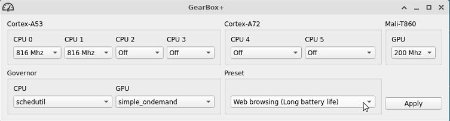

# gearboxplus

GUI tool to change the gears of the DevTerm A06 module.
  

## Compilation
This project is made with <3, C++ and Qt. To compile it you need gcc, CMake and Qt.  
 
`sudo apt install qtbase5-dev qt5-default gcc cmake`  

```bash  
mkdir build  
cd build  
cmake path/to/gearboxplus  
make
```

## Installation
Obtain the latest release from releases and `sudo dpkg -i gearboxplus_1.0_arm64.deb`